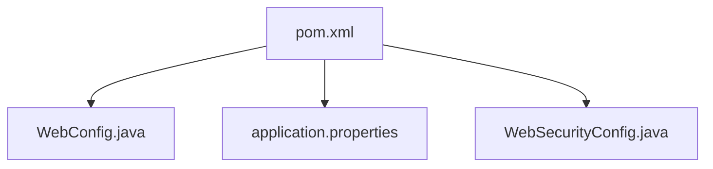

# Java-Spring-JPA
Simple JPA integration into Spring Java app

You must connect your own DB to work with this project,
you can do this simply change all vars in application.properties file


```
## default connection pool
spring.datasource.hikari.connectionTimeout=20000
spring.datasource.hikari.maximumPoolSize=5

## PostgreSQL
spring.datasource.url=jdbc:postgresql://localhost:5432/postgres // Your own IP
spring.datasource.username=postgres // Your own name
spring.datasource.password=qweqwe // Your own password

# create and drop table, good for testing, production set to none or comment it
spring.jpa.hibernate.ddl-auto=create-drop
```

Also, if u wanna use Spring Security in this project, u can uncomment maven dependence

```
		
<!--		<dependency>-->                                              //  
<!--			<groupId>org.springframework.boot</groupId>-->            //   JUST
<!--			<artifactId>spring-boot-starter-security</artifactId>--> // UNCOMMENT   
<!--		</dependency>-->                                          //  THIS   
		
```

And also uncomment WebConfig.java and WebSecurityConfig.java files to be able work with security

If you wanna change password or login of user u can do this in WebSecurityConfig.java

```
    @Bean
    public UserDetailsService userDetailsService() {
       UserDetails user =
                User.withDefaultPasswordEncoder()
                      .username("admin")
                      .password("admin")
                      .roles("ADMIN")
                      .build();

        return new InMemoryUserDetailsManager(user);
    }
```

Tree of files u must change:


